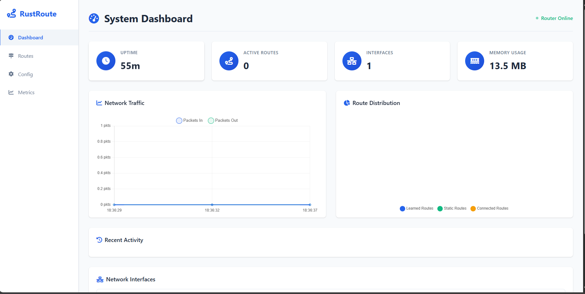
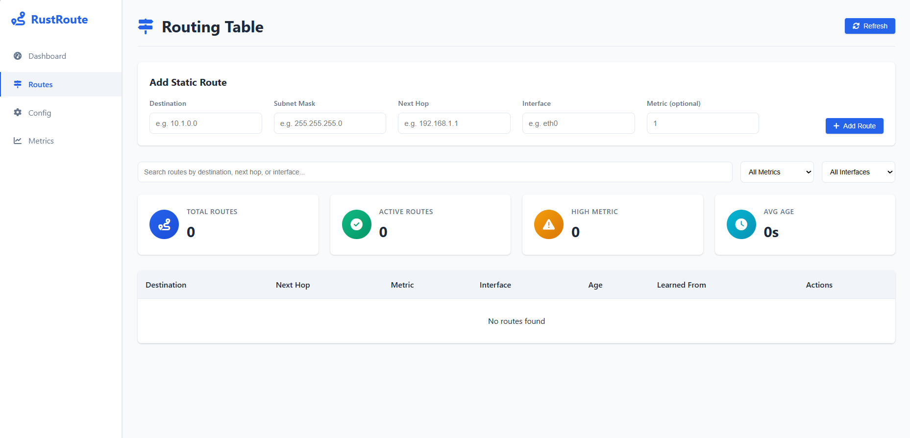
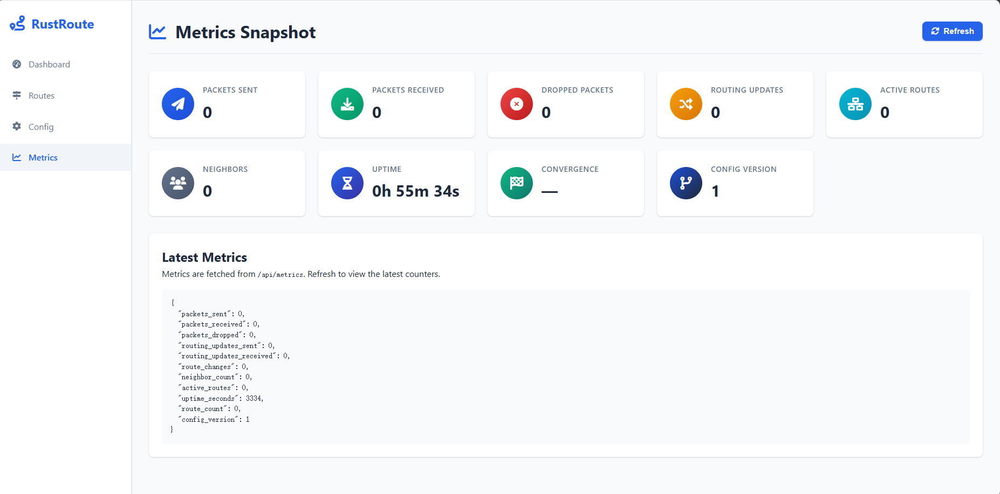
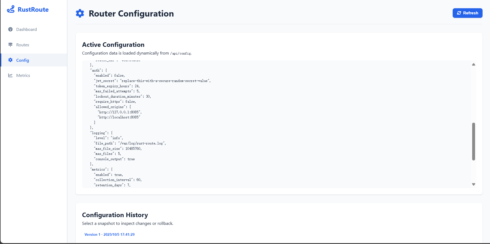

# 🦀 RustRoute

> RustRoute 是一个仍在积极开发中的实验性 RIP（Routing Information Protocol）学习项目。目前功能集聚焦于本地实验与代码示例，尚未达到企业级生产要求。相较最初版本，现阶段额外提供了带有认证感知的 Web 控制台、实时指标/路由可视化，以及可在浏览器内执行的配置历史对比与回滚功能。


## 当前状态

- ✅ 基础路由表实现：支持直连/静态路由、度量计算与超时处理
- ✅ 配置系统：JSON 配置文件 + 文件监听热重载、版本号追踪
- ✅ 指标收集：封装 `Metrics` 结构用于记录收发计数、路由数量、运行时间
- ✅ CLI 工具：提供 `start`/`config`/`test`/`benchmark` 等子命令便于调试
- 🟡 RIP 报文循环：正在补充周期性更新、邻居学习与动态路由能力
- 🔄 管理界面与认证：REST API、WebSocket、RBAC 等仍在开发计划中

详细差异与路线请参考 [`docs/gap_analysis_and_stories.md`](docs/gap_analysis_and_stories.md)。

## 快速开始

### 环境要求

- Rust 1.70 及以上
- Linux / macOS / Windows（建议 Linux 环境运行网络实验）
- 可选择的 UDP 测试网络，或在本机使用 127.0.0.0/8 地址段进行实验

### 构建与运行

```bash
# 拉取代码
git clone https://github.com/yourusername/rust-route.git
cd rust-route

# 编译调试版本
cargo build

# 直接使用默认配置启动（使用本地 rust-route.json）
cargo run -- start
```

> 根目录下的 `rust-route.json` 与运行时代码结构一致，包含 `interfaces`、`rip`、`web`、`auth`、`metrics` 等模块化配置。默认模板启用了 Web 仪表板、关闭认证，并将接口地址设置为局域网示例 `192.168.1.1/24`。若示例地址与本机不符，启动时会给出警告，可直接修改该文件后热重载生效。

> 若需要启用登录鉴权或多接口拓扑，可参考 `rust-route-web.json`，它演示了同时开启 `web.auth_enabled` 与 `auth.enabled` 以及自定义 Prometheus 端口的做法。

### 配置热重载

- 运行 `start` 子命令后，`ConfigManager` 会监控配置文件
- 修改配置文件并保存后，路由器会尝试重新加载
- 若验证失败，保留旧配置并输出错误日志

更多配置选项见 [`rust-route.json`](rust-route.json)、[`rust-route-web.json`](rust-route-web.json) 以及 `src/config_manager.rs` 中的字段定义。

## CLI 子命令速览

```bash
# 默认启动，使用 rust-route.json
rust-route start

# 校验配置文件
rust-route config validate --file my-config.json

# 生成默认配置
rust-route config generate --output new-config.json

# 运行内置样例测试（仅做基本断言）
rust-route test

# 运行简单基准（构建本地路由表示例数据）
rust-route benchmark
```

## 项目结构

```
rust-route/
├── src/
│   ├── auth.rs              # 认证配置骨架
│   ├── cli.rs               # CLI 参数与输出
│   ├── config_manager.rs    # 配置加载、热重载与备份
│   ├── ipv6.rs              # IPv6 RIP 原型（实验中）
│   ├── metrics.rs           # 指标采集
│   ├── network.rs           # UDP 接口封装
│   ├── network_discovery.rs # 网络发现原型
│   ├── protocol.rs          # RIP 报文结构/序列化
│   ├── router.rs            # 路由器主体逻辑
│   ├── routing_table.rs     # 路由表实现
│   └── web.rs               # REST API 框架（待完善）
├── tests/                   # 集成测试
├── benches/                 # Criterion 基准测试
├── docs/                    # 文档与规划
└── web/                     # 原型化的前端资源
```

## 开发计划

- 第一阶段：补齐基础 RIP 报文循环、动态路由学习与可运行测试
- 第二阶段：对接 WebSocket/REST API、完善认证、补强配置回滚
- 第三阶段：逐步实现 IPv6、网络发现、仪表板等高级功能

具体任务拆解与优先级详见 [`docs/gap_analysis_and_stories.md`](docs/gap_analysis_and_stories.md)。

## 许可证

项目基于 MIT 许可证发布，详情请查看 [LICENSE](LICENSE)。

---

> 💡 RustRoute 仍在快速迭代中，欢迎通过 Issue/PR 反馈问题或贡献代码。

## 前端可视化界面截图






